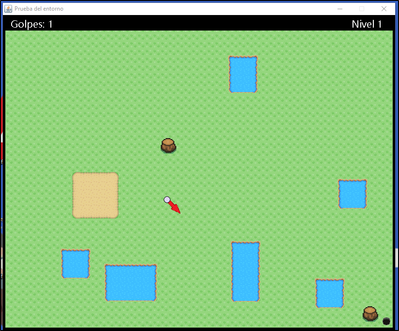

# 2D mini golf in Java

This a a project I built for one of my CS courses. It´s a fully functional mini golf in Java, with obstacles, power ups and infinite autogenerated levels.

## Obstacles and power ups

- Sand: Anakin's worst enemy, slows downs the ball
- Water: stops the ball completely, and left it at the border of the lake
- Trunk: causes the ball to bounce in the opposite direction
- Red star: speeds up the ball
- Purple crowns : teleports the ball to a random location

**Game preview**

## Demo
Find a demo video at media/demo.mp4